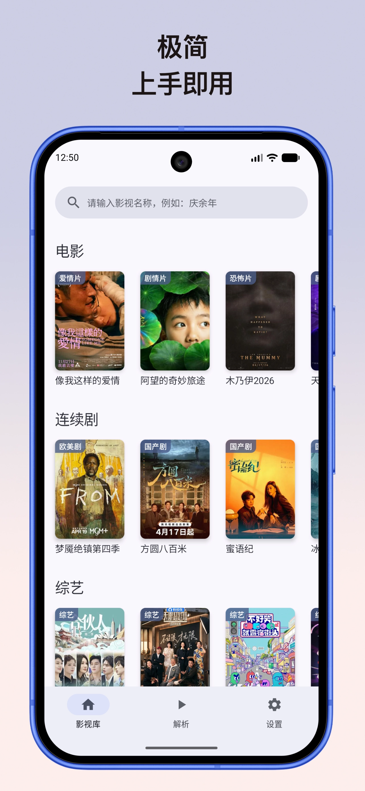
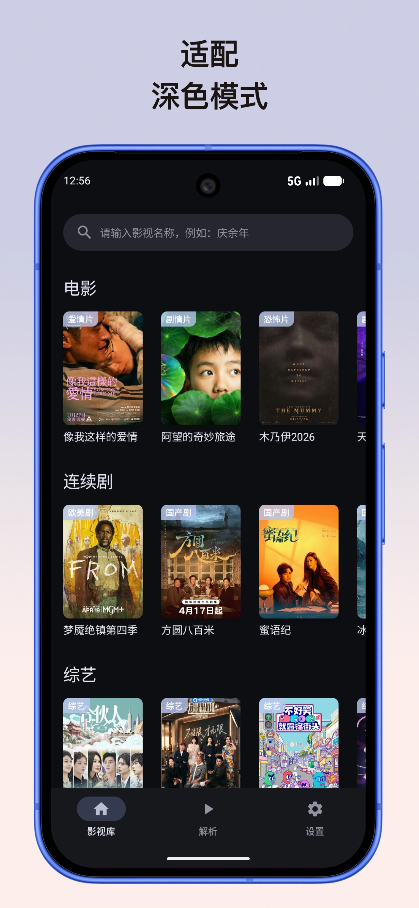
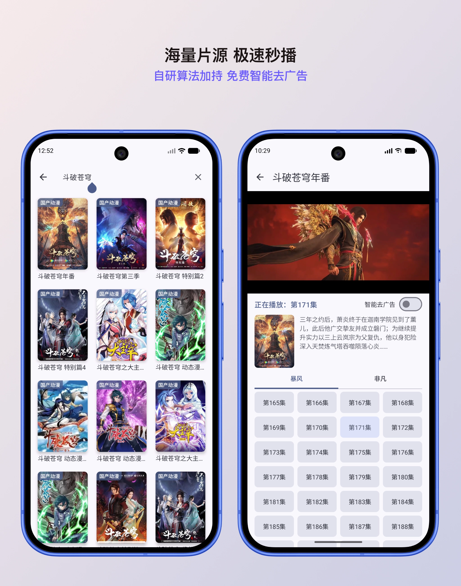

# Susan

Susan 是一个简洁易用的 Android App，支持爱奇艺、优酷、腾讯、芒果、哔哩哔哩等平台的解析播放，免费观看VIP视频。

[https://susan.letconst.dev](https://susan.letconst.dev)

## 系统要求

Android 7.0 及以上

## 特性

- 内置影视库，海量资源极速秒播
- 适配深色模式
- 适配 `Material You`（ >= Android 12），可根据系统壁纸自动变色
- 基于算法的智能去广告功能

## 解析

以腾讯视频为例：

1. 打开腾讯视频的任意剧集
2. 点击分享按钮，选择 「复制链接」（如：https://m.v.qq.com/x/m/play?vid=m0047xl3iup&cid=mzc0020027yzd9e）
3. 打开 Susan 底部的 `解析`，粘贴到输入框，点击 `开始解析` 即可

## 截图

## 下载

[Github Releases](https://github.com/Jiangmenghao/susan/releases)

## 相关应用

[黑猫VIP视频解析](https://vip.heimaokeji.xyz)，Susan 的 Web 版前身，支持弹幕、保存播放记录、自动搜寻下一集等实用功能，已适配多端、多浏览器及深色模式。

