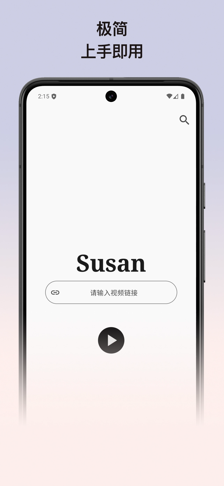
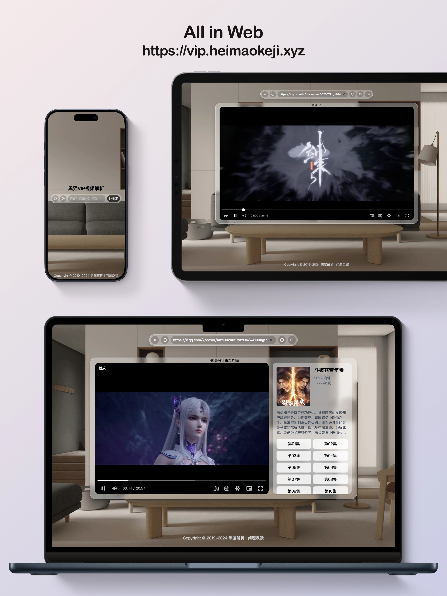

# Susan

Susan 是一个简洁易用的 Android App，支持爱奇艺、优酷、腾讯、芒果、哔哩哔哩等平台的解析播放，免费观看VIP视频。

此项目仅用于 Android 开发学习、交流，请勿商用。

## 系统要求

Android 7.0 及以上

## 使用方式（二选一）

### 直接搜索

1. 点击右上角的 `🔍` 按钮
2. 输入影片名称，例如 `斗破苍穹年番`
3. 点击任意集开始播放

### 手动复制

以腾讯视频为例：

1. 打开腾讯视频，播放任意视频
2. 点击分享按钮，选择 「复制链接」（如：https://m.v.qq.com/x/m/play?vid=m0047xl3iup&cid=mzc0020027yzd9e）
3. 打开 Susan，粘贴到输入框，点击播放即可

## 截图

## 下载

[Github Releases](https://github.com/Jiangmenghao/susan/releases)

## 相关应用

[黑猫VIP视频解析](https://vip.heimaokeji.xyz)，Susan 的 Web 版前身，支持弹幕、保存播放记录、自动搜寻下一集等实用功能，已适配多端、多浏览器及深色模式。

